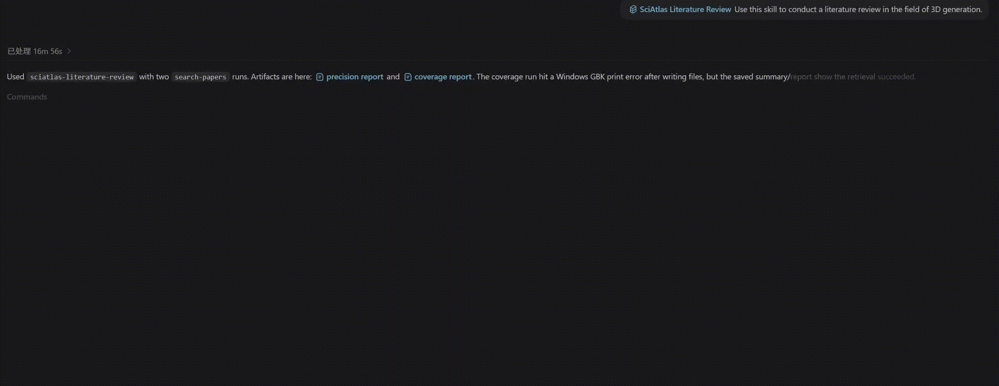

# SciAtlas Agent Skill Pack

This folder contains installable SciAtlas Agent Skills for Codex, Claude Code, and other tools that understand `SKILL.md`. Pick one when you want to describe a research goal in plain language and have the agent run the necessary setup, retrieval or workflow, artifact reading, and final synthesis. Use the ordinary CLI when you prefer to run and tune every command yourself.

These are project assets for coding and research agents. Each skill has a `SKILL.md` instruction file, with optional tool-specific UI metadata under `agents/`, so tools such as Codex, Claude Code, and other SKILL.md-aware agents can load or adapt the same workflow guidance.

<p align="center">
  
</p>

## Start Here

1. Choose the result you want from the table below.
2. Copy that Skill directory to your tool's skill folder; installation commands are in [Use](#use).
3. Start a new agent session and state the research goal naturally. The agent performs the routine setup and returns a task-specific result.

The agent handles everything it can automate. You provide only human-only information: a verification code, returned SciAtlas token, missing LLM/S2/KG credentials, a local PDF, or one necessary scope clarification.

### Credentials appear only when the selected Skill needs them

You do not need to collect every key before starting. The agent checks the current environment first and asks only for a missing value required by the selected Skill.

| Skill group | Usual additional setup |
|---|---|
| Quick paper search, idea grounding, trend report, researcher review | A SciAtlas token for hosted retrieval |
| Literature review | SciAtlas token and an LLM configuration when the workflow needs synthesis |
| Idea evaluation | SciAtlas token plus the LLM/S2/KG settings required by the configured review workflow |
| Idea generation | SciAtlas token and LLM configuration in hosted mode; local KG settings only when local KG mode is explicitly requested |

## Choose a Skill by Your Goal

| If you want to… | Start with | You will get… |
|---|---|---|
| Check a topic before investing more time | `sciatlas-quick-paper-search` | A small evidence-backed paper set and the best next step |
| Build a reading path, paper map, related-work section, or review | `sciatlas-literature-review` | An outline, evidence packs, or a formal review |
| Test whether an idea overlaps with prior work | `sciatlas-idea-grounding` | A prior-art matrix, differentiation risks, and next queries |
| Decide whether an idea or paper is worth pursuing | `sciatlas-idea-evaluate` | Automated review, reviewer/rubric evidence, and revision advice |
| Find research directions from a topic | `sciatlas-idea-generate` | Literature-grounded idea seeds and validation directions |
| Explain how a field has changed over time | `sciatlas-trend-report` | A timeline, representative papers, and emerging signals |
| Summarize a researcher's work from retrieved papers | `sciatlas-researcher-review` | An evidence-grounded profile, not an authoritative CV |

## Execution Guarantees

Each Skill limits the agent to the workflow that can produce its promised evidence trail. This keeps a report reproducible and prevents the agent from quietly replacing a dedicated workflow with an unrelated command.

| Skill | Agent execution boundary |
|---|---|
| `sciatlas-quick-paper-search` | `sciatlas search-papers` only |
| `sciatlas-literature-review` | `sciatlas literature-review` or `python run_sciatlas.py literature-review` only |
| `sciatlas-idea-grounding` | `sciatlas search-papers` only |
| `sciatlas-idea-evaluate` | `sciatlas idea-evaluate` or `python run_sciatlas.py idea-evaluate` only |
| `sciatlas-idea-generate` | `python -m sciatlas_idea_gen.main` only |
| `sciatlas-trend-report` | `sciatlas search-papers` only |
| `sciatlas-researcher-review` | `sciatlas search-papers` only |

## Flash vs Full

For `sciatlas-literature-review`, `sciatlas-idea-evaluate`, and `sciatlas-idea-generate`, use `flash` by default and switch to `full` when the user asks for deeper coverage or the flash artifacts are too thin.

The Agent Skill directories do not have `*-full` variants. Those names (for example, `literature-review-full`) belong to the separate CLI JSON preset registry and are used through `sciatlas skill run`. An Agent keeps the same Skill selected and passes `--workflow full` only when the request or the available evidence calls for it.

| Workflow skill | `flash` behavior | `full` behavior |
|---|---|---|
| `sciatlas-literature-review` | Compact KG/S2 search and evidence packs for fast outlines or reading lists. | Broader multi-round retrieval and formal review drafting/integration. |
| `sciatlas-idea-evaluate` | Smaller reviewer, manifest, rubric, and evidence budgets for quick critique. | Fuller reviewer/rubric/grounding/review/report path. |
| `sciatlas-idea-generate` | Compact graph and compressed gate/selection stages for fast idea seeds. | Broader seed graph, inspiration search, and novelty-feedback path. |

## Novice-Friendly Contract

Every skill should take a user from a blank machine to a final downstream result:

- install or locate the SciAtlas CLI/workflow when possible;
- guide browser registration and ask only for email, verification code, returned SciAtlas token, LLM/S2/KG credentials, or one necessary task clarification;
- configure shell variables or `.env` without printing secrets;
- run the allowed command or current workflow itself;
- read `runs/<run_id>/` artifacts before answering;
- return the final research deliverable, not just instructions.

## Runtime Prerequisites

The four retrieval-only Skills (`quick-paper-search`, `idea-grounding`,
`trend-report`, and `researcher-review`) can use the package-only CLI. The
three dedicated workflow Skills (`literature-review`, `idea-evaluate`, and
`idea-generate`) require a full SciAtlas checkout and its workflow dependencies:

```bash
git clone https://github.com/zjunlp/SciAtlas.git
cd SciAtlas
python -m pip install -e ./sciatlas
python -m pip install -r requirements-workflows.txt
```

Do not use the GitHub `#subdirectory=sciatlas` installation for a dedicated
workflow: it intentionally contains only the core CLI package.

## Use

### Git

Git is the source checkout for the Agent Skill pack. Clone it once, then pull the repository when you want updated skill instructions:

```bash
git clone https://github.com/zjunlp/SciAtlas.git
cd SciAtlas
git pull
```

Run the copy commands below from the repository root.

### Claude Code

Claude Code loads filesystem skills from `~/.claude/skills` on macOS/Linux or `%USERPROFILE%\.claude\skills` on Windows. Copy one selected directory by default, then restart Claude Code or refresh the workspace.

```powershell
# Windows PowerShell: install one selected Skill
New-Item -ItemType Directory -Force "$env:USERPROFILE\.claude\skills" | Out-Null
Copy-Item -Recurse .\agent-skill\sciatlas-literature-review "$env:USERPROFILE\.claude\skills\"
```

```bash
# macOS / Linux: install one selected Skill
mkdir -p ~/.claude/skills
cp -R ./agent-skill/sciatlas-literature-review ~/.claude/skills/
```

Replace `sciatlas-literature-review` with the Skill chosen above. If you want every task available, use `sciatlas-*` instead. You can also keep the same directories in a project-local `.claude/skills/` folder when the workflows should stay scoped to one repository.

### Codex

Codex uses the installed Codex environment and loads skills from `~/.codex/skills` on macOS/Linux or `%USERPROFILE%\.codex\skills` on Windows. Copy one selected directory by default, then start a new Codex session.

```powershell
# Windows PowerShell: install one selected Skill
New-Item -ItemType Directory -Force "$env:USERPROFILE\.codex\skills" | Out-Null
Copy-Item -Recurse .\agent-skill\sciatlas-literature-review "$env:USERPROFILE\.codex\skills\"
```

```bash
# macOS / Linux: install one selected Skill
mkdir -p ~/.codex/skills
cp -R ./agent-skill/sciatlas-literature-review ~/.codex/skills/
```

Replace `sciatlas-literature-review` with the Skill chosen above. Use `sciatlas-*` only when you want every task available. The instructions in each Skill directory are self-contained; the CLI/workflow executables, tokens, credentials, and `runs/<run_id>/` artifacts remain external runtime dependencies. Keep tokens and run artifacts out of `agent-skill/`. Other agent tools can adapt the same folders when their skill/plugin loader supports filesystem skills.

The skills are written for zero-start users. If the CLI, token, LLM key, S2 key, or workflow configuration is missing, the agent should install/configure what it can, guide the user through browser registration at `http://sciatlas.openkg.cn/register`, ask only for missing human-provided values, and continue until retrieval or the dedicated workflow produces artifacts and a final task answer.

## Design Notes

- Keep each skill small enough to load quickly.
- Keep operational defaults aligned with the CLI preset for each skill. Dedicated workflows expose `flash` and `full` paths; flash may skip, compress, or stop after lightweight stages and records that in artifacts.
- Do not put API tokens or run artifacts in this folder.
- Use `runs/<run_id>/summary.json`, `result.json` or `response.json`, `report.md`, and workflow subdirectories as the evidence trail after each run.
